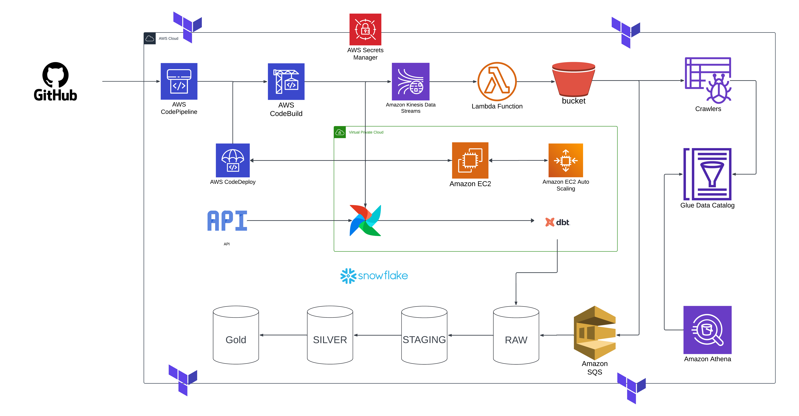

# Project Data Pipeline

## Introduction

This project utilizes AWS Lambda, AWS Kinesis, and AWS CodeDeploy, orchestrated by Apache Airflow, to implement a scalable data ingestion and processing pipeline. This README provides guidelines on how to set up and run the project, as well as an overview of the data modeling approach.

## Folder Structure

- `airflow/`: Contains Airflow DAG files for orchestrating the data pipelines.
- `api_test/`: Includes tests for API validation.
- `codedeploy_scripts/`: Scripts used by AWS CodeDeploy for deployment.
- `modules/`: Terraform modules for reusable infrastructure code.
- `setup_pipeline/`: Scripts for setting up the data pipeline.
- `src/lambda_function/`: Source code for AWS Lambda functions.

## Getting Started

### Prerequisites

- AWS CLI configured with appropriate credentials.
- Terraform installed and configured.
- Apache Airflow installed either locally or on a server.
- Python 3.x installed.

### Setup and Deployment

1. **Infrastructure Setup:**

   Navigate to the Terraform directory to initialize and apply Terraform configurations:

   ```bash
   ./setup_pipeline.sh
   ```

2. **Data Architecture:**

   The pipeline follows a **Data Vault 2.0** methodology to ensure scalability, historical tracking, and normalization of the data. Below is an overview of the Data Vault 2.0 architecture employed in the project:

   

3. **ETL Pipeline:**

   The pipeline includes a structured ETL process, extracting data from Binance API, transforming it, and loading it into the data warehouse for analytics. The architecture is as follows:

   

4. **Remove Resources:**

   To remove resources and clean up the environment after use, execute the following script:

   ```bash
   ./destroy_resource.sh
   ```
